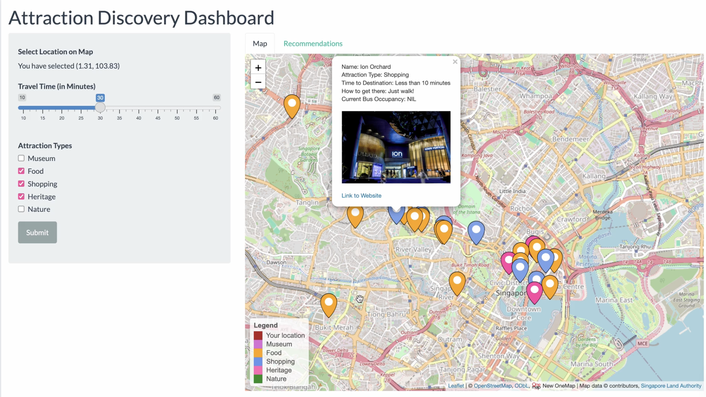
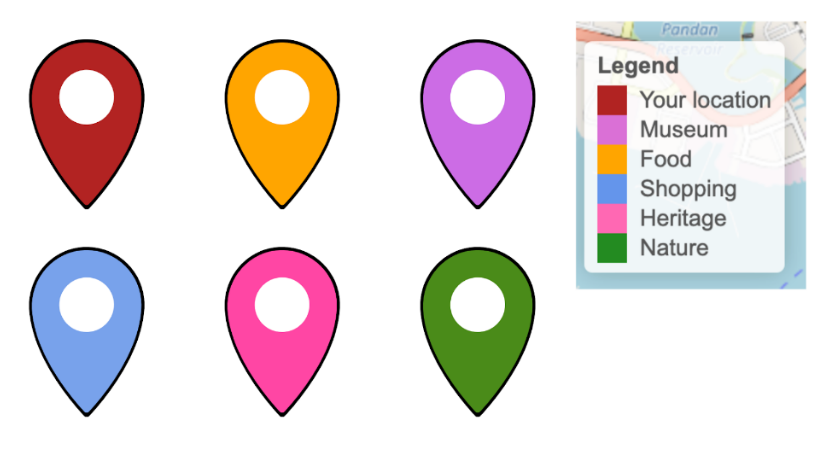
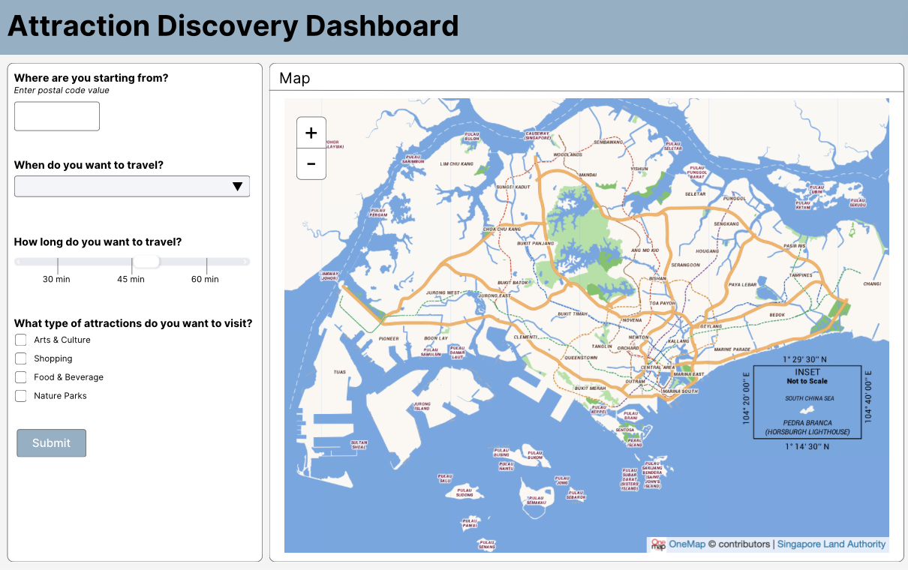
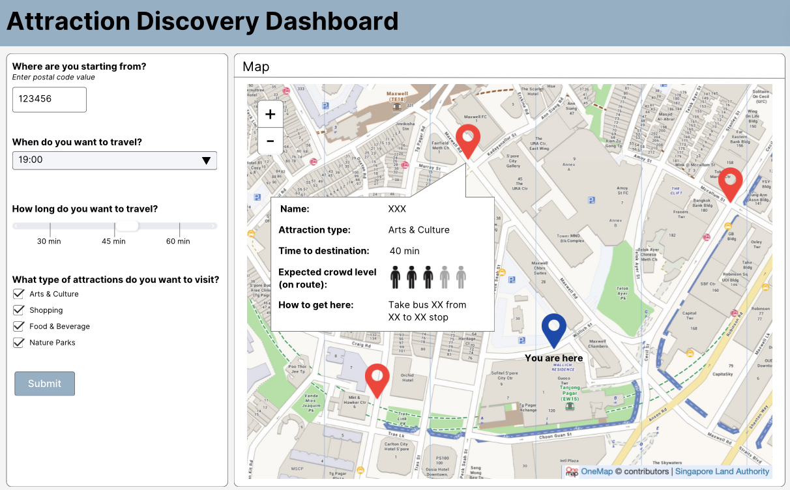
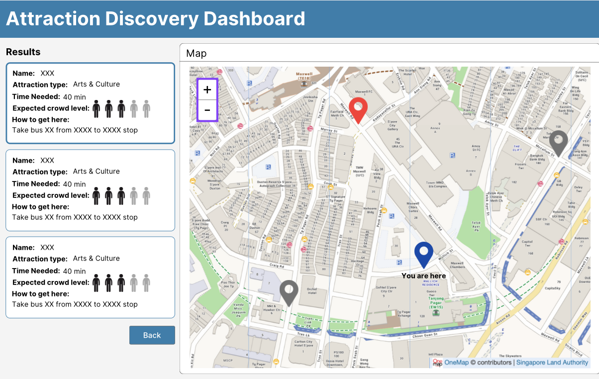

```{r setup, include=FALSE}
knitr::opts_chunk$set(echo = TRUE)
```
\newpage
# Overview
This technical report spans the ideation of the full project, and how backend and the frontend teams respectively coded their scripts to tackle the tourist planning problem. The teams will give a basic overview of their logical workflow, and their respective code snippets into making their scripts work. There will also be possible future developments the team raised after doing a review, as well as an overall conclusion on the success of tackling the problem we started with.

# Getting Started
We will first start by providing an overview of our project's GitHub repository, which can be accessed through this [link](https://github.com/shaeanneeu/DSE3101_LTA_Public). The repo's main directory contains the `backend_code.R` and `frontend_code.R`, which are the two respective scripts for backend and frontend respectively. The subfolders "Datasets" and "Tokens" contain the required local datasets and API tokens respectively for the backend to use while running. Other items in the repo include this technical documentation R markdown and pdf file, and the icons used to generate the markers in the dashboard. 

To run the application, you will first need to obtain API keys to retrieve data from LTA DataMall and Instagram. Links can be found [here](https://datamall.lta.gov.sg/content/datamall/en/request-for-api.html) and [here](https://developers.facebook.com/docs/instagram-basic-display-api) respectively to obtain the tokens. The LTA DataMall API Token can be used indefinitely whilst the Instagram Token needs to be refreshed by 2024-05-22 and every 60 days after. 

Once obtaining the LTA DataMall API Token, the Instagram Access Token and Client Token, you will need to add them to the csv files under the "Tokens" folder. 

Now we are ready to run the `frontend_code.R` file.The dashboard is coded in R version 4.3.2 (2023-10-31) and all libraries/packages are updated as of 2024-04. The packages required to run the dashboard can be loaded by running the code chunk below:

```{r libraries, warning = FALSE, message=FALSE}
library(tidyverse)
library(shiny)
library(shinythemes)
library(leaflet)
library(DT)
library(htmltools)
library(shinybusy)
library(geosphere)
library(jsonlite)
```

The list of bus stops and curated list of tourist attractions in Singapore is updated as of 2024-04.

# Dashboard Backend 
## Main Panel Features [Outputs]
This section aims to provide a technical analysis of the backend code of tourist attraction discovery dashboard. It documents the rationale for each function of the dashboard. The full code for the dashboard's backend can be found in the script named `backend_code.R` in the GitHub repo or attached as Appendix B.

The local datasets that we have collated and stored in Github include `Bus_stops_wroutes.csv`, `Singapore Tourist Attractions.csv`, `bus_routes.csv`, `bus_stops.csv`, `food_locations.csv`, `food_locations_wcoords.csv`, `tourist_locations_wproximalbusstops.csv`. We rely on manipulating these datasets to return the eventual results to the user. 

### Instagram Dataset Test
The team used Jay’s personal food blog account (Instagram: @pandareviewsfood) for delicacies recommendations. We also manipulated Instagram tokens to store the information in a local csv file for ease of manipulation. The backend team filtered for only ratings equal to or above 7 to give our users a pleasant dining experience. 
```{r Instagram filter, eval=FALSE, results='hide'}
  ## Filter for only ratings >=7 and removes unnecessary food reviews
  if (test_int >= 7) {
    if (str_detect(row, paste(phrases, collapse = "|"))) {
      return(FALSE)
    } else {
      return(TRUE)
    }
  } else {
    return(FALSE)
  }
```

### Bus Stops
The first section of the back-end code involves reading in datasets using the LTA API. An example is shown below where we read in the `bus_stops` dataset. We used a while loop as only 500 rows can be read in one query, before binding the rows together to retrieve the complete dataset. 

```{r Getting bus stops information, eval=FALSE, results='hide'}
if (!bus_stops_file_exists) {
  bus_stops_url <- "http://datamall2.mytransport.sg/ltaodataservice/BusStops"
  skip_number <- 0
  df <- data.frame() # Create an empty data frame to store the data

  while (TRUE) {
    url <- paste0(bus_stops_url, "?$skip=", skip_number)
    temp <- GET(url, add_headers(headers))
    res <- content(temp)

    temp_df <- do.call(rbind, res$value)
    temp_df <- as.data.frame(temp_df)
    if (nrow(temp_df) == 0) {
      break # Exit the loop if there's no more data
    }

    df <- rbind(df, temp_df) # Append the data to the main data frame
    skip_number <- skip_number + 500
  }
```
### Bus Routes and joining with Bus Stops
The `Bus Route` LTA dataset only provides the list of intermittent `BusStopCode` along a particular bus route and their respective `StopSequence`. In order to store that information locally for further manipulation and reduce the amount of query operations later, we joined the `Bus Route` and `Bus Stops` datasets together based on the common variable `BusStopCode` to obtain a consolidated file named ‘Bus_Stops_WRoutes’. In order to keep our dataset lean, we only selected useful variables to keep.

```{r Getting local database, eval=FALSE, results='hide'}
if (!bus_routes_consolidated_filepath_exists) {
  consolidated_file <- bus_routes %>%
    left_join(bus_stops, by = "BusStopCode") %>%
    select(ServiceNo, Direction, StopSequence, BusStopCode, 
           Description, Latitude, Longitude) # Useful variables to keep

  write.csv(consolidated_file, file = "Bus_stops_wroutes.csv", row.names = FALSE)
```
### Joining Tourist Locations with Bus Stops
To reduce further querying, by using the function `closest_bus_stop` later on, we created another dataset named `tourist_locations_wproximabusstops` to include a column of closest bus_stops,`ProximalBusStops`, near each tourist attraction. Thus, we just need to check if the alighting bus stops of the tourists fall into any row of this column. From there, we will be able to return the valid destinations to the tourist. 

```{r creating tourist_locations_wproximalbusstops, eval=FALSE, results='hide'}
## Adding closest bus-stops to attractions to local file to reduce api_calls later
total_results_df <- data.frame(bus_stops = character())
if (!tourist_locations_wproximalbusstops_filepath_exists) {
  for (i in 1:nrow(tourist_locations)) {
    location <- tourist_locations[i, ]
    print(location)
    temp_df <- closest_bus_stop(as.numeric(location[4]), as.numeric(location[3]), bus_stops_wroutes)
    result_df <- data.frame(bus_stops = paste(unique(temp_df$BusStopCode), 
                                              collapse = ","))
    total_results_df <- rbind(total_results_df, result_df)
  }
  tourist_locations$ProximalBusStops <- unlist(total_results_df)
```
### Distance Function
The first function that we worked on is `calculate_distance`. After doing some research, we decided to use the `distVincentySphere` function by R that takes in the longitudinal and latitudinal coordinates of two points and returns the shortest distance between them. However, one limitation we need to note is that this includes distances over water bodies, hence, we left out tourist attractions in the Sentosa area. 

```{r calculate_distance function, eval=FALSE, results='hide'}
## Distance Function
calculate_distance <- function(row, lat, long) {
  point <- as.numeric(c(row["Longitude"], row["Latitude"]))
  distance <- distVincentySphere(point, c(long, lat))
  return(distance)
}
```

### Closest Bus Stops to User
Next, we hope to find the nearest bus stops to the user with the function `closest_bus_stop`. We take the geographical coordinates of the user’s selected location and apply `calculate_distance` on every row of `Bus_Stops_WRoutes`, saving those whose distance is less than or equal to 500m. With that, we return bus stops that the user can walk to. 

```{r closest_bus_stop function, eval=FALSE, results='hide'}
## Finding nearest bus_stop in 500m
closest_bus_stop <- function(lat, long, bus_stops_wroutes) {
  temp <- as.data.frame(bus_stops_wroutes)
  temp$dist <- apply(temp, 1, function(row) calculate_distance(row, lat, long))
  ### Finds bus_stops in 500m radius
  # print(temp)
  ### Selecting closest bus stops for each bus
  wanted_bus_stops <- which(temp$dist <= 500)
  wanted <- temp[wanted_bus_stops, c("ServiceNo", "Direction", 
                                     "BusStopCode", "Description", "dist")]
  ### Having only the closest distance busstop for each bus
  wanted <- wanted %>% group_by(ServiceNo, Direction) %>% slice_min(dist)

  return(wanted)
} 
```

### Approaching Buses to User's Bus Stop
Moving on, we wrote a function on `bus_approaching` to filter for buses in the `closest_stops` based on estimated arrival time (ETA). This function solely checks for whether the ETA is within the desired travelling time input given by the user.

```{r bus_approaching function, eval=FALSE, results='hide'}
# Function to filter buses in closest_stops based on estimated arrival time
bus_approaching <- function(row, headers, time_threshold) {
  bus_arrival_url <- 
    "http://datamall2.mytransport.sg/ltaodataservice/BusArrivalv2"
  temp <- GET(bus_arrival_url, add_headers(headers),
    query = list(BusStopCode = row["BusStopCode"], ServiceNo = row["ServiceNo"])
  )
  res <- content(temp)
  if (length(res$Services) == 0) {
    return(FALSE)
  }
  ## Checks for time to be later than the user time
  if (as.POSIXct(res$Services[[1]]$NextBus$EstimatedArrival, 
                 format = "%Y-%m-%dT%H:%M:%S") - Sys.time() 
      < as.difftime(time_threshold, units = "mins")) {
    return(TRUE)
  } else {
    return(FALSE)
  }
}
```

### Rationale for Running Total
However, the team noticed a limitation of the API. There could be multiple buses of the same service no. in close time proximity to one another along the same bus route. Hence, we will not be able to ensure that the initial bus the user is taking is also the same bus reaching the alighting bus stop as there might be buses in between.

Since we are not given unique bus identifiers from the API, we have devised an improvised method to track the bus - by looking at the run_total.

We take in the first timing `origin_time`, which is the time when the current bus stop receives its first bus. Next, we make use of the `running_total` function to check if the next bus stop’s first bus ETA is earlier than the first bus ETA of the current stop, if so, that means there is the presence of a faster bus between the current bus stop and the next bus stop. Hence, we would use the second’s bus ETA instead and add that to our running total. Ultimately, this function serves the role of finding the estimated duration taken to take a user from point A to point B.

```{r Getting first time, eval=FALSE, results='hide'}
# Section of code to derive Running Total 
  if (is.null(origin_time)) {
    origin_time <- as.POSIXct(res$NextBus$EstimatedArrival,
                                  format = "%Y-%m-%dT%H:%M:%S")
    start_time <- origin_time
    bus_stops_reached <- rbind(bus_stops_reached, BusStopCode)
    running_totals <- rbind(running_totals, running_total)
    bus_load <- res$NextBus$Load
    # print(bus_load)
    # print(origin_time)
    next
  } else {
    time_diff <- difftime(as.POSIXct(res$NextBus$EstimatedArrival, 
                                      format = "%Y-%m-%dT%H:%M:%S"), 
                          origin_time, units = "mins")
    # Check if the time difference is within the acceptable range
    if (time_diff >= as.difftime(30, units = "secs")) {
      # print(time_diff)
      origin_time <- as.POSIXct(res$NextBus$EstimatedArrival, 
                                format = "%Y-%m-%dT%H:%M:%S")
      running_total <- running_total + time_diff
    } else {
      time_diff <- difftime(as.POSIXct(res$NextBus2$EstimatedArrival, 
                                        format = "%Y-%m-%dT%H:%M:%S"), 
                            origin_time, units = "mins")
          # print(time_diff,1)
          origin_time <- as.POSIXct(res$NextBus$EstimatedArrival, 
                                    format = "%Y-%m-%dT%H:%M:%S")
          running_total <- running_total + time_diff
        }
        bus_stops_reached <- rbind(bus_stops_reached, BusStopCode)
        running_totals <- rbind(running_totals, running_total)
      }
```

Next, we return the `ServiceNo`, `OriginalBusStopCode`, `BusStartTime` and `Load` of the bus, along with the `BusStopCode` of intermediate bus stops reached by the bus from point A to point B within the running total. We thus have valid destination bus stops the user can be at.

```{r Getting bus stops, eval=FALSE, results='hide'}
# Obtaining valid destination bus stops 
  bus_stops_reached_wtime <- cbind(as.data.frame(bus_stops_reached), 
                                   as.data.frame(running_totals))
  names(bus_stops_reached_wtime) <- c("BusStopCode", "ETA")

  bus_stops_reached_wtime <- bus_stops_reached_wtime %>%
    filter(ETA <= time_alloted)

  bus_stops_reached_wtime$ServiceNo <- ServiceNo
  bus_stops_reached_wtime$OriginBusStopCode <- OriginBusStopCode
  bus_stops_reached_wtime$BusStartTime <- start_time
  bus_stops_reached_wtime$Load <- bus_load

  return(bus_stops_reached_wtime)
```

### Checking to see Valid Tourist Locations
Using the same logic, we need to check for tourist locations reached. We focus on variables including `BusStopCode`, `ETA`, `ServiceNo`, `OriginBusStopCode`, `BusStartTime`, `Load`.

```{r checking for tourist location matches, eval=FALSE, results='hide'}
  for (i in 1:nrow(bus_stops_reached_all)) {
    bus_stop <- bus_stops_reached_all[i, ]
    matching_rows <- which(grepl(bus_stop[[1]], 
                                 tourist_locations_wproximalbusstops$ProximalBusStops))
    tourist_location_reached <- tourist_locations_wproximalbusstops[matching_rows, ]
    tourist_location_reached$BusStopCode <- bus_stop[[1]]
    tourist_location_reached$ETA <- bus_stop[[2]]
    tourist_location_reached$ServiceNo <- bus_stop[[3]]
    tourist_location_reached$OriginBusStopCode <- bus_stop[[4]]
    tourist_location_reached$BusStartTime <- bus_stop[[5]]
    tourist_location_reached$Load <- bus_stop[[6]]
    tourist_location_reached_mod <- rbind(tourist_location_reached_mod,
                                          tourist_location_reached)
  }
```

### Function Returning Output to Frontend
Lastly, we created the `wanted_attractions` function which uses functions that we have discussed above. We use `closest_stops` to find out the bus stops closest to the user in terms of distance. Among these bus stops returned, we filter for those that have buses arriving in 5 minutes. Next, we compare `bus_stops_reached` with bus stops that are near the tourist attractions. If they match, we return these attractions to the user. 

This function is later called by the frontend script. 

```{r wanted_attractions function, eval=FALSE, results='hide'}
wanted_attractions <- function(lat, long, wanted_types, time_interval) {
  ## Checking for bus in 5 minutes
  closest_stops$approaching <- apply(closest_stops, 1, 
                                     function(row) bus_approaching(row, headers, 5))
  closest_stops <- closest_stops[closest_stops$approaching == TRUE, ]

  ## Checking what busstops have been reached
  for (i in 1:nrow(closest_stops)) {
    row <- closest_stops[i, ]
    bus_stops_reached <- bus_stops_visited(bus_stops_wroutes, 
                                           row$ServiceNo, 
                                           row$Direction, 
                                           row$BusStopCode, 
                                           as.difftime(time_interval - 10, 
                                                       # 10 minutes as walking time
                                                       unit = "mins"))
    # print(bus_stops_reached)
    bus_stops_reached_all <- rbind(bus_stops_reached_all, 
                                   bus_stops_reached)
  }
  # Filtering bus_stops that don't pass criteria
  bus_stops_reached_all <- bus_stops_reached_all %>%
    filter(if_any(everything(), ~ !is.na(.)))

  ## Checking which tourist_location can be reached
  all_attractions <- (tourist_location_check(tourist_locations_wproximalbusstops, 
                                             bus_stops, 
                                             bus_stops_reached_all))
  all_attractions_filtered <- all_attractions %>%
    filter(Type %in% wanted_types)
  
  return(all_attractions_filtered)
}
```

# Dashboard Frontend 
## Overall Design Methodology
The overall goal for the frontend team was to design a user-centric dashboard which is easy to use. We first searched for references online to draw inspiration from other dashboards out there. We compiled a few of our favourites before making our initial interface designs on Canva. We have attached some of our designs in Appendix . Lastly, we implemented our design using the R `Shiny` app package. 

{width="75%"}

## Technical Implementation Details 
This section will document the design, rationale and code for each feature of the dashboard. The code for the dashboard's frontend can be found in the script named `frontend_code.R` in the GitHub repo or attached as Appendix C. The skeleton for this script is:

```{r frontend_skeleton, results='hide'}
ui <- fluidPage(
  # UI Features go here 
)
server <- function(input, output, session){
  # Server Functions go here 
}
shinyApp(ui = ui, server = server)
```

We will explain the frontend implementation **feature by feature** as a user would interact with the dashboard, rather than going line by line of the code. This means that for some features, we will have code snippets from both the `ui` and `server` sections of the code. 

### Interface Design
The interface of this dashboard is split into a side panel and main panel using Shiny's `sidebarLayout()` in the `ui` section of the code. This matched the design specifications of from our Canva designs. The left side panel would contain the input features, whilst the main panel would contain the outputs.

```{r frontend_interface, results='hide'}
sidebarLayout(
    sidebarPanel(
      # Input Features go here 
    ),
    mainPanel(
      # Map & Table Output go here 
    )
)
```

The dashboard uses `shinytheme`'s `flatly` theme as the frontend team felt that this layout most closely resembled our Canva designs. The `flatly` theme is simple and does not have any distracting elements.

```{r frontend_theme}
theme = shinytheme("flatly")
```

Lastly, the frontend team also specified the title of the Attraction Discovery Dashboard in the title panel. 
```{r frontend_title, results='hide'}
titlePanel(h1("Attraction Discovery Dashboard"))
```

### Side Panel Features [Inputs]
**Input Selection**    
After the user initialises the dashboard, they would customise their Location, Travel Time and Attraction Type Preferences in the left side bar panel. This section provides more details on those inputs. 

*Location Input*    
In the `ui` section, the location input is first marked by the header below. After which, a text output is provided to inform users of the coordinates of the location picked. 

```{r frontend_location1, results='hide'}
# UI code sections 
h5(strong("Select Location on Map"))
textOutput("test")
```
  
The location input is designed to allow users to click on a part of the map. More details on the map initialisation will be explained later. Information on the clicked location is stored as `input$map_click`, which includes the latitudinal and longitudinal coordinates. To indicate to the user which location has been selected, a marker is added in the `server` section of the code. Lastly, the `server` code prepares the text output to inform users of the coordinates of the location that they have picked.   
  
```{r frontend_location2}
# Server code sections 
observeEvent(input$map_click, {
  click <- input$map_click
  lat <- click$lat 
  lng <- click$lng
    
  proxy <- leafletProxy("map") # Initialise Map 
  proxy %>% clearMarkers() %>% # Add Markers 
    addMarkers(group = "input", lng, lat, icon = icon_list['Input']) %>%
    setView(lng, lat, zoom = 16)
    
  output$test <- renderText({ # Text Output 
    paste0("You have selected ", "(", round(lat,2), ", ", round(lng,2), ")")
  })
  selected_location(TRUE)
})
```
  
*Time Input*   
The travel time input is coded using Shiny's `sliderInput()` function. This allows users to select their desired maximum travel between 10 minutes to 60 minutes, with a step of 5 minutes. The minimum value was chosen as this was determined as the walking time between 1) a user's location and origin bus stop (5 minutes) and  2) destination bus stop and attraction (5 minutes). The maximum travel time was chosen as users are unlikely to want to travel longer than 1 hour. Additionally, Singapore's small geographic size means that most places are reachable within 1 hour of travel time. The default value of the slider was set to 10 minutes. 

```{r frontend_time, results ='hide'}
#UI code sections 
sliderInput("travel_time", "Travel Time (in Minutes)", min = 10, max = 60, 
            value = 10, step = 5)
tags$head(tags$style(HTML(".shiny-split-layout > div {overflow: visible;}")))
```
  
*Attraction Type Input*  
The last input for users to decide is which types of attractions they want to receive recommendations for. This is coded using Shiny's `checkboxGroupInput`. Users are able to choose one or more attraction types from the following categories: Museum, Food, Shopping, Heritage and Nature. 
```{r frontend_attractiontype, results ='hide'}
#UI code sections
checkboxGroupInput('attraction_type', 'Attraction Types', 
                   c("Museum", "Food", "Shopping", "Heritage", "Nature"))                        
```
  
**Post Input Selection**    
*Action Button*    
After users select their inputs, they will click on the `Submit` button to generate the attraction recommendations. This is coded as an `actionButton`.
```{r frontend_button, results = 'hide'}
#UI code sections 
actionButton("trigger", "Submit")
```
  
*Trigger Event & Loading Screen*  
Clicking the action button triggers an `Event` on the server side to take the user's inputs and generate the attraction recommendations. This is coded using Shiny's `observeEvent()` function, where the `eventExpr` (event expression) is the clicking of the `Submit` button. 

The frontend team also decided to include a loading animation which is displayed when the dashboard is processing the results. This acts as a clear indicator to users that the dashboard is performing some backend work, so that the user is not left in the dark during the 10-20 seconds in which the results are being retrieved. 
```{r frontend_trigger, results = 'hide'}
# Server code sections
observeEvent(input$trigger, {
  show_modal_spinner(spin = "spring", color = "grey", text = "Loading...")
  # Code to retrieve results.
  remove_modal_spinner()
})
```
  
*Error Messages & Notifications*  
As part of our effort to make a user centric dashboard, we wanted to ensure that the experience using the dashboard would be guided. This included some easy to interpret error and warning messages as well as notifications to prompt users on what next steps to take.  

The error messages are returned if there are no selected locations or selected attraction types. To execute this, we initialised triggers as `reactiveVal()` which update as a user selects inputs. As the travel time input has a default value of 10 minutes, we will not run into the case where there is no selected travel time. 

```{r frontend_error, results = 'hide'}
# Server code sections
## Initialise Error Trigger
selected_location <- reactiveVal(FALSE)
selected_attraction <- reactiveVal(character(0))
# Code to observe location selected
selected_location(TRUE)
# Code to observe attractions selected
observe({
    selected_types <- input$attraction_type
    selected_attraction(selected_types)  
  })
  
observeEvent(input$trigger, {
  # Code to add loading animation goes here 
  ## Error Message
  if(!selected_location()) {
    showNotification("Please select location on map!", 
                     duration = 5, type = "error", closeButton = TRUE)
    remove_modal_spinner()
    return()
  }
    
  if(length(selected_attraction()) == 0) {
    showNotification("Please select attraction types!", 
                     duration = 5, type = "error", closeButton = TRUE)
    remove_modal_spinner()
    return()
  }
})
```


After the results are generated, the user is prompted with a notification to click on each marker for more information. However, if no recommendations are generated, users are too far away from recommendations. Thus users are prompted with a warning to increase the travel time window.  

```{r frontend_notif, results = 'hide'}
# Server code sections
observeEvent(input$trigger, {
  ## Notifications
  if(nrow(df_real) > 0) {
    showNotification("Click on each marker for more info!", duration = 5, type = "message")
  } else {
    showNotification("Please increase travelling time window.", duration = 5, type = "warning")
  }
})
```

### Integration with Backend [Connecting Inputs & Outputs]
To generate curated results, we integrate frontend features with backend functions from `backend_code.R` based on the inputs selected by the user. The result generated from the backend is stored in a dataframe named `df`. We mutated certain columns in `df` such as bus occupancy acronyms, route details and travel times to make the results interpretable for users.  These updated outputs are saved in a new dataframe called `df_real`. 

```{r frontend_integration, results = 'hide'}
# Server code sections
## Obtaining Recommendations from Backend 
observeEvent(input$trigger, {
  source('backend_code.R')

  attraction_type_vector = as.vector(strsplit(selected_attraction(), split = " "))
    
  df = wanted_attractions(input$map_click$lat, input$map_click$lng, attraction_type_vector,
                            input$travel_time) 
    
  ## Rephrasing Outputs
  df_real = df %>%
    mutate(Occupancy = case_when((Load == "SEA" & TravelMode == "Bus") ~ "Seats Available" ,
                                 (Load == "SDA" & TravelMode == "Bus") ~ "Standing Available",
                                 (Load == "LSD" & TravelMode == "Bus") ~ "Limited Standing",
                                 TRUE ~ 'NIL')) %>%
    mutate(Directions = case_when(TravelMode == "Bus" ~ paste("Take bus", ServiceNo, "
                                                             from", OriginBusStopName, "to", 
                                                             DestinationBusStopName),
                                  TravelMode == "Walk" ~ "Just walk!")) %>%
    mutate(TravelTime = case_when(TravelMode == "Bus" ~ paste(round(ETA,0) + 10), 
                                  #Add 10 minutes to account for walking time
                                  TravelMode == "Walk" ~ "Less than 10"))
})
```

### Main Panel Features [OUTPUTS]
After the users submit their inputs, the dashboard will output relevant recommendations. Results are presented in two tabs: Map and Recommendations. This section provides more details on the outputs. 

**Map Tab**    
*Geospatial Initialisation*  
Under the Map tab, OneMapSG was initialised using library called `leaflet`. The map view was set to facilitate users in finding their location in Singapore and viewing recommendations.

```{r frontend_map_initial, results = 'hide'}
# Server code sections
server <- function(input, output, session){
## Initial Map
  output$map <- renderLeaflet({
    leaflet() %>% addTiles() %>% 
    addProviderTiles(providers$OneMapSG.Default) %>%
    setView(103.81, 1.35, zoom = 13) #%>%
  })
}
```

*Recommendation Marker*  
The attraction recommendations are represented by custom map markers. These markers would appear on the map once the results were generated using the backend function. Since we had 5 attraction types, we wanted to colour the markers accordingly so that users would be able to easily distinguish between recommendations. Additionally, this would help to differentiate between markers for the results and the initial marker that appeared when users selected their location. 

{width="25%"}

We customised the markers on Canva before downloading and importing into an `icon_list` in R. 

```{r frontend_icon, results = 'hide'}
# Server code sections
## Marker Icons 
icon_list <- iconList(
  Input = makeIcon("marker_input.png", iconWidth = 40, iconHeight = 55),
  Museum = makeIcon("marker_museum.png", iconWidth = 40, iconHeight = 55),
  Food = makeIcon("marker_food.png", iconWidth = 40, iconHeight = 55),
  Shopping = makeIcon("marker_shopping.png", iconWidth = 40, iconHeight = 55),
  Heritage = makeIcon("marker_heritage.png", iconWidth = 40, iconHeight = 55),
  Nature = makeIcon("marker_nature.png", iconWidth = 40, iconHeight = 55)
)
  
## Add Map Marker 
observeEvent(input$map_click, {  
  proxy %>% addMarkers(group = "recommendations",
                       df_real$DestinationLongitude, df_real$DestinationLatitude, 
                       icon = icon_list[df_real$Type],
                       popup = popup_content)
})
```

*Marker Legend*  
We also added a legend at the bottom left corner of the map for users to reference. 

```{r frontend_legend, results = 'hide'}
# Server code sections
server <- function(input, output, session){
  output$map <- renderLeaflet({
    addLegend("bottomleft", 
              colors = c("firebrick","orchid", "orange", "cornflowerblue", 
                         "hotpink", "forestgreen"),
              labels = c("Your location", "Museum", "Food", "Shopping", "Heritage", "Nature"),
              title = "Legend",
              opacity = 1)
  })
}
```

*Output Popup*  
To learn more about each recommendation, users can click on the customized marker. A popup page will appear with the following information: Name of the attraction, Attraction type, Travel time needed, Directions to the attractions (bus number, boarding bus stop, alighting bus stop), Bus occupancy, Image of the attraction, and Website link. The rationale for providing the image and link is to help users visualise and learn more about the attraction without having to search for the attraction names themselves, saving their time. When users click on the link, they will be directly brought to the website page.

```{r frontend_output, results = 'hide'}
# Server code sections
## Output Popup
observeEvent(input$trigger, {
  popup_content <- paste("Name:", df_real$Destination, "<br/>",
                         "Attraction Type:", df_real$Type, "<br/>",
                         "Time to Destination:", df_real$TravelTime, "minutes", "<br/>",
                         "How to get there: ", df_real$Directions, "<br/>",
                         "Current Bus Occupancy:", df_real$Occupancy, "<br/>", "<br/>",
                         "<div style='text-align:center;'>",
                        "", "</div>")
    
  popup_content <- ifelse(!is.na(df_real$`Website Link`) & df_real$`Website Link` != "", 
                          paste0(popup_content, "<br/>",
                                 "<a href='", df_real$`Website Link`, 
                                 "' target='_blank'>Link to #Website</a>"),
                          popup_content)
})
```

**Recommendations Tab**  
Under the Recommendations tab, users will receive an overview of recommendations based on their inputs in the form of a summary table. The table displays the most relevant information from the output, including Attraction destination, Attraction type, Travel time needed, Bus occupancy, and Website link.

With this summary table, users can select the number of results shown per page, order travel time in ascending or descending order to see which takes the least amount of time, and search for keywords using a search bar.

```{r}
# Server code sections
## Display Recommendations as table 
observeEvent(input$trigger, {
  output$tablerecs = DT::renderDT({
  df_real %>% 
    select(Destination, Type, TravelTime, Occupancy, `Website Link`) %>%
      DT::datatable()
  })
})
```

# Future Improvements 
**Backend**  
The next thing to look into is to include multi-bus routes into this project. Currently, the user is assumed to be taking only 1 bus from origin to destination. Multi-bus routes are computationally more expensive, however this is something that needs to be greatly considered given Singapore's connectivity through public transport.

MRT routes should also be addded once the necessary API is provided by LTA. It's connectivity allows for a substantial reduction of time from place to place in Singapore, and can add much more value to the dashboard.

More attractions should also be added to the dashboard. This can be done through further web scraping for non-food attractions, while we can look into scraping other Instagram review food accounts for more trusted food reviews.

**Frontend**  
To improve user experience, users' location should be automatically initialised to their current location without them having to toggle around the map or click on a specific location. A search bar will also be useful to facilitate finding users' locations.

More details on bus routes should be provided, particularly the intermediate bus stops between the boarding and alighting stops to facilitate users' journeys.

Lastly, `markers.png` of different colored markers should be organized in a single folder instead of separately. However, errors occur when trying to do so, as the icons would not render. Hence, further troubleshooting is required.

# Conclusion
As a basic test of whether we can incorporate LTA Datamall API into solving a current problem, our dashboard fully succeeds in this area. However, there are definitely improvements in both features as well as optimization of coding to give the user a better experience in the future when the dashboard moves into market.

\newpage
# Appendix 

**Appendix A**

Canva Designs

{width="50%"}
{width="50%"}
{width="50%"}


**Appendix B**  
Backend script file  

```{r backend full code, eval=FALSE, results='hide'}
library(readr)
library(httr)
library(geosphere)
library(jsonlite)
library(lubridate)
library(tidyr)
library(tidyverse)
library(readxl)
library(fuzzyjoin)

current_dir <- getwd()

tokens_dir <- file.path(current_dir, "Tokens")
datasets_dir <- file.path(current_dir, "Datasets")

api_key_filepath <- file.path(tokens_dir, "lta_api_token.csv")
api_key_file <- read_csv(api_key_filepath)
api_key <- api_key_file$AccountKey
headers <- c(AccountKey = api_key)

bus_stops_filepath <- file.path(datasets_dir, "bus_stops.csv")
bus_stops_file_exists <- file.exists(bus_stops_filepath)

### Getting bus stops information
if (!bus_stops_file_exists) {
  bus_stops_url <- "http://datamall2.mytransport.sg/ltaodataservice/BusStops"
  skip_number <- 0
  df <- data.frame() # Create an empty data frame to store the data

  while (TRUE) {
    url <- paste0(bus_stops_url, "?$skip=", skip_number)
    temp <- GET(url, add_headers(headers))
    res <- content(temp)

    temp_df <- do.call(rbind, res$value)
    temp_df <- as.data.frame(temp_df)
    if (nrow(temp_df) == 0) {
      break # Exit the loop if there's no more data
    }

    df <- rbind(df, temp_df) # Append the data to the main data frame
    skip_number <- skip_number + 500
  }

  flat_df <- unnest(df, cols = c(BusStopCode, RoadName, Description, Latitude, Longitude))
  write.csv(flat_df, file = bus_stops_filepath, row.names = FALSE) # Save the complete data frame as 'bus_stops.csv'
  print("File downloaded as bus_stops.csv")
} else {
  print("File exists")
}

bus_stops <- read_csv(bus_stops_filepath)
bus_stops

### Instagram Tokens

ig_token_key_filepath <- file.path(tokens_dir, "ig_token.csv")
ig_token_file_exists <- file.exists(ig_token_key_filepath)
client_secret_filepath <- file.path(tokens_dir, "ig_client_secret.csv")
client_secret_token_file <- read_csv(client_secret_filepath)
client_secret <- client_secret_token_file$SecretCode

if (!ig_token_file_exists) {
  ### Instagram API
  code <- "AQADhvoWdu482cDGfQocmNrSry7rh4sH7a0bhLojRoSawjZ0zB0eL5JnH-E-SpY5oWtDojARxK2s_QZmQwaagiABS9W4sO5gqZ1xZ3k1_hn5Jnlj3d4f1W2pEbl4cei8neDAzxJ48Df-uOswufuYxencxTbF61uJVL1z85-6UEYnbQ7Zw4Jk8-ZBhsQZMV7VEemGFTgTBWldLLCflAnpavXZz1DpNG_ZzrnENcmS93R0YA"

  params <- list(
    client_id = "1074040483264515", client_secret = client_secret, code = code,
    grant_type = "authorization_code", redirect_uri = "https://jiakaihoo.wixsite.com/pandacon"
  )

  ### Short_lived token
  request <- POST(url = "https://api.instagram.com/oauth/access_token", body = params)
  requestJSON <- content(request)
  short_lived_access_token <- requestJSON$access_token

  ### Long_lived token
  params <- list(
    access_token = short_lived_access_token, client_secret = client_secret,
    grant_type = "ig_exchange_token"
  )

  request <- GET(url = "https://graph.instagram.com/access_token", query = params)
  requestJSON <- content(request)
  long_lived_access_token <- requestJSON$access_token
  current_time <- format(Sys.time(), "%Y-%m-%d %H:%M:%S")
  token_df <- data.frame(
    access_token = c(long_lived_access_token),
    time = current_time
  )
  ## Writing to csv file
  write.csv(token_df, ig_token_key_filepath, row.names = FALSE)
} else {
  print("File exists")
}

ig_token_file <- read_csv(ig_token_key_filepath)
ig_token <- ig_token_file$access_token

### Retrieval of locations
food_locations_file_name <- file.path(datasets_dir, "food_locations.csv")
food_locations_file_name_exists <- file.exists(food_locations_file_name)

if (!food_locations_file_name_exists) {
  params <- list(access_token = token, fields = "id,caption,media_url,permalink,timestamp")
  food_df <- data.frame()

  request <- GET(url = "https://graph.instagram.com/me/media", query = params)
  requestJSON <- content(request)
  temp_df <- do.call(rbind, lapply(requestJSON$data, as.data.frame))
  food_df <- rbind(food_df, temp_df)

  # params = list(access_token = token, fields = 'id,media_url,permalink,timestamp')
  # request <- GET(url = 'https://graph.instagram.com/17966518561288167/children', query = params)
  # requestJSON <- content(request)
  # temp_df = do.call(rbind, lapply(requestJSON$data, as.data.frame))
  # food_df = rbind(food_df, temp_df)

  ## Loops using the API [The next link is tagged in the JSON if it exists]
  while (TRUE) {
    if (!is.null(requestJSON$paging$`next`)) {
      print(requestJSON$paging$`next`)
      request <- GET(url = requestJSON$paging$`next`)
      requestJSON <- content(request)
      temp_df <- do.call(rbind, lapply(requestJSON$data, as.data.frame))

      food_df <- rbind(food_df, temp_df)
    } else {
      break
    }
  }

  ## Filter for only ratings >=7 and removes unnecessary food reviews
  above_7 <- sapply(food_df$caption, function(row) {
    ### Non-wanted cause of various reasons, i.e. cheap/closed/private dining
    phrases <- c(
      "Chagee", "Evviva", "Sakeya", "Chaffic", "\\{Closed\\}", "Heytea", "HEYTEA", "Fruce", "Whale Tea", "\\[Delivery\\]",
      "Pots and Pans", "Fragrance", "Fardello", "CHICHA"
    )
    match <- str_extract(row, ":\\s\\d")
    if (is.na(match)) {
      return(FALSE) # If ":" is not found
    } else {
      test_int <- substr(match, nchar(match), nchar(match))
      # Extract the substring after the first ":"
      # Check if the number is greater than 7
      if (test_int >= 7) {
        if (str_detect(row, paste(phrases, collapse = "|"))) {
          return(FALSE)
        } else {
          return(TRUE)
        }
      } else {
        return(FALSE)
      }
    }
  })

  ## Modifications of the dataframe to be stored so it can be merged with the rest of the attractions
  wanted_food_df <- food_df[above_7, ]
  wanted_food_df_destination <- sapply(wanted_food_df$caption, function(row) {
    destination <- str_extract(row, str_extract(row, "^[^[:\\[\\]]]+"))
    return(destination)
  })
  wanted_food_df$destination <- wanted_food_df_destination
  wanted_food_df$type <- "food"
  wanted_food_df$"latitude & longitude" <- NA
  wanted_food_df <- wanted_food_df[, c("destination", "type", "latitude & longitude", "permalink", "timestamp", "id")]

  # Save the result
  write.csv(wanted_food_df, food_locations_file_name, row.names = FALSE)
} else {
  print("File exists")
}

food_locations <- read_csv(food_locations_file_name)

## Manually add coordinates for location
food_locations_wcoords_filepath <- file.path(datasets_dir, "food_locations_wcoords.csv")
food_locations_mod <- read_csv(food_locations_wcoords_filepath)

## Total locations
tourist_locations_wcoords_filepath <- file.path(datasets_dir, "Singapore Tourist Attractions.csv")
tourist_locations <- read_csv(tourist_locations_wcoords_filepath)

## Bus Routes
bus_routes_filepath <- file.path(datasets_dir, "bus_routes.csv")
bus_routes_file_exists <- file.exists(bus_routes_filepath)

if (!bus_routes_file_exists) {
  bus_routes_url <- "http://datamall2.mytransport.sg/ltaodataservice/BusRoutes"
  skip_number <- 0
  df <- data.frame() # Create an empty data frame to store the data

  while (TRUE) {
    url <- paste0(bus_routes_url, "?$skip=", skip_number)
    temp <- GET(url, add_headers(headers))
    res <- content(temp)
    temp_df <- do.call(rbind, res$value)
    temp_df <- as.data.frame(temp_df)

    if (nrow(temp_df) == 0) {
      break # Exit the loop if there's no more data
    }

    df <- rbind(df, temp_df) # Append the data to the main data frame
    skip_number <- skip_number + 500
  }
  ## Add a flat_df function since the df are in lists of one to let them save into a csv
  flat_df <- unnest(df, cols = c(
    ServiceNo, Operator, Direction, StopSequence, BusStopCode, Distance, WD_FirstBus, WD_LastBus,
    SAT_FirstBus, SAT_LastBus, SUN_FirstBus, SUN_LastBus
  ))
  write.csv(flat_df, file = bus_routes_filepath, row.names = FALSE) # Save the complete data frame as 'bus_stops.csv'
} else {
  print("File exists")
}

bus_routes <- read_csv(bus_routes_filepath)
bus_routes

## local file to store the bus route of each bus
bus_routes_consolidated_filepath <- file.path(datasets_dir, "bus_stops_wroutes.csv")
bus_routes_consolidated_filepath_exists <- file.exists(bus_routes_consolidated_filepath)

if (!bus_routes_consolidated_filepath_exists) {
  consolidated_file <- bus_routes %>%
    left_join(bus_stops, by = "BusStopCode") %>%
    select(ServiceNo, Direction, StopSequence, BusStopCode, Description, Latitude, Longitude)

  write.csv(consolidated_file, file = "Bus_stops_wroutes.csv", row.names = FALSE)

  bus_stops_wroutes <- read_csv(bus_routes_consolidated_filepath)
} else {
  print("bus routes consolidated exists")
}

bus_stops_wroutes <- read_csv(bus_routes_consolidated_filepath)

## Google uses lat long
# Test datacase
MBS <- c(1.2839454495737048, 103.85937544472274)
busstop_near_MBS <- c(1.2806844615667559, 103.85507356421047)

## Distance Function
calculate_distance <- function(row, lat, long) {
  point <- as.numeric(c(row["Longitude"], row["Latitude"]))
  distance <- distVincentySphere(point, c(long, lat))
  return(distance)
}

## Finding nearest bus_stop in 500m
closest_bus_stop <- function(lat, long, bus_stops_wroutes) {
  temp <- as.data.frame(bus_stops_wroutes)
  temp$dist <- apply(temp, 1, function(row) calculate_distance(row, lat, long))
  ### Finds bus_stops in 500m radius
  # print(temp)
  ### Selecting closest bus stops for each bus
  wanted_bus_stops <- which(temp$dist <= 500)
  wanted <- temp[wanted_bus_stops, c("ServiceNo", "Direction", "BusStopCode", "Description", "dist")]
  ### Having only the closest distance busstop for each bus
  wanted <- wanted %>%
    group_by(ServiceNo, Direction) %>%
    slice_min(dist)

  return(wanted)
} # get the busstopcode and roadname with the index of shortest distance, and also tell the user how far he/she is from the nearest bus stop

# test closest bus stop function and calculate distance function with MBS bus stop
# closest_stops <- closest_bus_stop(test_coordinates[2], test_coordinates[1], bus_stops_wroutes)
# closest_stops

## Adding closest bus-stops to attractions to local file so it takes less time with api_calls later
tourist_locations_wproximalbusstops_filepath <- file.path(datasets_dir, "tourist_locations_wproximalbusstops.csv")
tourist_locations_wproximalbusstops_filepath_exists <- file.exists(tourist_locations_wproximalbusstops_filepath)

total_results_df <- data.frame(bus_stops = character())
if (!tourist_locations_wproximalbusstops_filepath_exists) {
  for (i in 1:nrow(tourist_locations)) {
    location <- tourist_locations[i, ]
    print(location)
    temp_df <- closest_bus_stop(as.numeric(location[4]), as.numeric(location[3]), bus_stops_wroutes)
    result_df <- data.frame(bus_stops = paste(unique(temp_df$BusStopCode), collapse = ","))
    total_results_df <- rbind(total_results_df, result_df)
  }
  tourist_locations$ProximalBusStops <- unlist(total_results_df)
  write.csv(tourist_locations, tourist_locations_wproximalbusstops_filepath, row.names = FALSE)
} else {
  print("tourist_locations_wproximalbusstops_name_exists")
}

tourist_locations_wproximalbusstops <- read_csv(tourist_locations_wproximalbusstops_filepath)

# Function to filter buses in closest_stops based on estimated arrival time
bus_approaching <- function(row, headers, time_threshold) {
  bus_arrival_url <- "http://datamall2.mytransport.sg/ltaodataservice/BusArrivalv2"
  temp <- GET(bus_arrival_url, add_headers(headers),
    query = list(BusStopCode = row["BusStopCode"], ServiceNo = row["ServiceNo"])
  )
  res <- content(temp)
  if (length(res$Services) == 0) {
    return(FALSE)
  }
  # print(paste("Next Bus Estimated Arrival:", res$Services[[1]]$NextBus$EstimatedArrival, ";", "Seats Availability:", res$Services[[1]]$NextBus$Load))
  # print(as.POSIXct(res$Services[[1]]$NextBus$EstimatedArrival, format = "%Y-%m-%dT%H:%M:%S"))
  if (as.POSIXct(res$Services[[1]]$NextBus$EstimatedArrival, format = "%Y-%m-%dT%H:%M:%S") - Sys.time() < as.difftime(time_threshold, units = "mins")) {
    return(TRUE)
  } else {
    return(FALSE)
  }
}

# temp_bus_approaching <- closest_stops
# temp_bus_approaching$approaching <- apply(temp_bus_approaching, 1, function(row) bus_approaching(row, headers, 5))
# temp_bus_approaching<- temp_bus_approaching[temp_bus_approaching$approaching == TRUE,]

# Getting bus_stops_visited
bus_stops_visited <- function(bus_stops_wroutes, ServiceNo, Direction, BusStopCode, time_alloted) {
  ## Testing variables
  # ServiceNo = 174
  # Direction = 1
  # BusStopCode = 21161
  # time_alloted <- as.difftime(50, units = "mins")
  
  # print(BusStopCode)
  # print(time_alloted)
  bus_stops_reached <- list()
  running_total <- 0
  running_totals <- list()
  origin_time <- NULL
  OriginBusStopCode <- BusStopCode
  
  ## Check if no BusStops pass
  if (is.na(BusStopCode)){
    return(data.frame())
  }

  
  bus_stops_sequence <- bus_stops_wroutes[bus_stops_wroutes$BusStopCode == BusStopCode &
    bus_stops_wroutes$ServiceNo == ServiceNo, ]$StopSequence
  bus_stops_check <- bus_stops_wroutes[bus_stops_wroutes$ServiceNo == ServiceNo &
    bus_stops_wroutes$Direction == Direction &
    bus_stops_wroutes$StopSequence >= bus_stops_sequence, ]

  bus_arrival_url <- "http://datamall2.mytransport.sg/ltaodataservice/BusArrivalv2"
  # df_test <- list()

  # print(bus_stops_check)
  # Iterate through each bus's ETA, see if any bus_stops cannot arrive on time
  for (BusStopCode in bus_stops_check$BusStopCode) {
    # print(ServiceNo)
    # print(running_total)

    if (running_total <= time_alloted) {
      temp <- GET(bus_arrival_url, add_headers(headers),
        query = list(BusStopCode = BusStopCode, ServiceNo = ServiceNo)
      )
      res <- content(temp)
      if (length(res$Services) == 0) {
        return(NA)
      }
      res <- res$Services[[1]]
      # df_test <- c(df_test, list(res))

      ## Gets first time
      if (is.null(origin_time)) {
        origin_time <- as.POSIXct(res$NextBus$EstimatedArrival, format = "%Y-%m-%dT%H:%M:%S")
        start_time <- origin_time
        bus_stops_reached <- rbind(bus_stops_reached, BusStopCode)
        running_totals <- rbind(running_totals, running_total)
        bus_load <- res$NextBus$Load
        # print(bus_load)
        # print(origin_time)
        next
      } else {
        time_diff <- difftime(as.POSIXct(res$NextBus$EstimatedArrival, format = "%Y-%m-%dT%H:%M:%S"), origin_time, units = "mins")
        # Check if the time difference is within the acceptable range
        if (time_diff >= as.difftime(30, units = "secs")) {
          # print(time_diff)
          origin_time <- as.POSIXct(res$NextBus$EstimatedArrival, format = "%Y-%m-%dT%H:%M:%S")
          running_total <- running_total + time_diff
        } else {
          time_diff <- difftime(as.POSIXct(res$NextBus2$EstimatedArrival, format = "%Y-%m-%dT%H:%M:%S"), origin_time, units = "mins")
          # print(time_diff,1)
          origin_time <- as.POSIXct(res$NextBus$EstimatedArrival, format = "%Y-%m-%dT%H:%M:%S")
          running_total <- running_total + time_diff
        }
        bus_stops_reached <- rbind(bus_stops_reached, BusStopCode)
        running_totals <- rbind(running_totals, running_total)
      }
    } else {
      break
    }
  }

  # print(bus_stops_reached)
  # print(running_totals)
  bus_stops_reached_wtime <- cbind(as.data.frame(bus_stops_reached), as.data.frame(running_totals))
  names(bus_stops_reached_wtime) <- c("BusStopCode", "ETA")

  bus_stops_reached_wtime <- bus_stops_reached_wtime %>%
    filter(ETA <= time_alloted)

  bus_stops_reached_wtime$ServiceNo <- ServiceNo
  bus_stops_reached_wtime$OriginBusStopCode <- OriginBusStopCode
  bus_stops_reached_wtime$BusStartTime <- start_time
  bus_stops_reached_wtime$Load <- bus_load

  return(bus_stops_reached_wtime)
}

# bus_stops_reached_wtime = cbind(as.data.frame(c('01619','03071','01529','02111')),as.data.frame(c(0,10,20,15)))
# names(bus_stops_reached_wtime) <- c('BusStopCode',"ETA")
#

# tourist_location_reached_mod <- data.frame()
# bus_stops_reached_all = bus_stops_reached_wtime

## Checking for tourist location matches

tourist_location_check <- function(tourist_locations_wproximalbusstops, bus_stops, bus_stops_reached_all) {
  tourist_location_reached_mod <- data.frame()
  for (i in 1:nrow(bus_stops_reached_all)) {
    bus_stop <- bus_stops_reached_all[i, ]
    matching_rows <- which(grepl(bus_stop[[1]], tourist_locations_wproximalbusstops$ProximalBusStops))
    tourist_location_reached <- tourist_locations_wproximalbusstops[matching_rows, ]
    tourist_location_reached$BusStopCode <- bus_stop[[1]]
    tourist_location_reached$ETA <- bus_stop[[2]]
    tourist_location_reached$ServiceNo <- bus_stop[[3]]
    tourist_location_reached$OriginBusStopCode <- bus_stop[[4]]
    tourist_location_reached$BusStartTime <- bus_stop[[5]]
    tourist_location_reached$Load <- bus_stop[[6]]
    tourist_location_reached_mod <- rbind(tourist_location_reached_mod, tourist_location_reached)
  }

  tourist_location_reached_mod$BusStopCode <- as.character(tourist_location_reached_mod$BusStopCode)
  tourist_location_reached_mod$ETA <- as.double(tourist_location_reached_mod$ETA)
  tourist_location_reached_mod$ServiceNo <- as.character(tourist_location_reached_mod$ServiceNo)
  tourist_location_reached_mod$OriginBusStopCode <- as.character(tourist_location_reached_mod$OriginBusStopCode)
  tourist_location_reached_mod$Load <- as.character(tourist_location_reached_mod$Load)

  # Bugtesting
  # return(tourist_location_reached_mod)
  # tourist_location_reached_mod = a

  tourist_location_reached_mod_ordered <- tourist_location_reached_mod %>%
    select(-ProximalBusStops) %>%
    inner_join(bus_stops, by = c(BusStopCode = "BusStopCode")) %>%
    select(-RoadName) %>%
    rename(
      DestinationLatitude = Latitude.x,
      DestinationLongitude = Longitude.x,
      DestinationBusStopCode = BusStopCode,
      DestinationBusStopName = Description,
      DestinationBusStopLatitude = Latitude.y,
      DestinationBusStopLongitude = Longitude.y
    ) %>%
    inner_join(bus_stops, by = c(OriginBusStopCode = "BusStopCode")) %>%
    select(-RoadName) %>%
    rename(
      OriginBusStopName = Description,
      OriginBusStopLatitude = Latitude,
      OriginBusStopLongitude = Longitude
    ) %>%
    mutate(BusEndTime = BusStartTime + as.difftime(ETA, unit = "mins")) %>%
    group_by(Destination) %>%
    mutate(ETA_min = min(BusEndTime)) %>%
    ungroup() %>%
    filter(ETA_min == BusEndTime) %>%
    select(-ETA_min) %>%
    mutate(TravelMode = ifelse(BusStartTime == BusEndTime, "Walk", "Bus")) %>%
    group_by(Destination) %>%
    slice(1)


  return(tourist_location_reached_mod_ordered)
}

wanted_attractions <- function(lat, long, wanted_types, time_interval) {
  ## Required data
  # api_key <- "3x+HF5oTQ0eDUnVeFjakIQ=="
  # headers <- c(AccountKey = api_key)
  # bus_stops_wroutes <- read_csv("bus_stops_wroutes.csv")
  # tourist_locations_wproximalbusstops <- read_csv("tourist_locations_wproximalbusstops.csv")
  bus_stops_reached_all <- data.frame()

  ## Function calls
  ## Getting closest stops to user
  closest_stops <- closest_bus_stop(lat, long, bus_stops_wroutes)

  ## Checking for bus in 5 minutes
  closest_stops$approaching <- apply(closest_stops, 1, function(row) bus_approaching(row, headers, 5))
  closest_stops <- closest_stops[closest_stops$approaching == TRUE, ]

  ## Checking what busstops have been reached
  for (i in 1:nrow(closest_stops)) {
    row <- closest_stops[i, ]
    bus_stops_reached <- bus_stops_visited(bus_stops_wroutes, row$ServiceNo, row$Direction, row$BusStopCode, 
                                           as.difftime(time_interval - 10,unit = "mins"))
    # print(bus_stops_reached)
    bus_stops_reached_all <- rbind(bus_stops_reached_all, bus_stops_reached)
  }
  # Filtering bus_stops that don't pass criteria
  bus_stops_reached_all <- bus_stops_reached_all %>%
    filter(if_any(everything(), ~ !is.na(.)))

  ## Checking which tourist_location is Ok
  all_attractions <- (tourist_location_check(tourist_locations_wproximalbusstops, bus_stops, bus_stops_reached_all))
  all_attractions_filtered <- all_attractions %>%
    filter(Type %in% wanted_types)

  return(all_attractions_filtered)
}

## Testrun
# test_1 <- c(1.3050779239689276, 103.83175851424681)
# test_2 = c(1.28, 103.8)
# a <- wanted_attractions(test_1[1], test_1[2],c("Food","Shopping","Heritage"),20)

# write_csv(a,"test_df.csv")
```

**Appendix C**  
Frontend script file  

```{r frontend full code, eval=FALSE, results='hide'}
#install.packages("shinythemes")
#install.packages("shinyWidgets")
#install.packages("shinyTime")
#install.packages("DT")
#install.packages("shinybusy")

library(tidyverse)
library(shiny)
library(shinythemes)
library(leaflet)
library(htmltools)
library(shinybusy)

ui <- fluidPage(
  theme = shinytheme("flatly"),
  
  ### Title ###
  titlePanel(h1("Attraction Discovery Dashboard")),
  
  sidebarLayout(
    ### Sidebar ###
    sidebarPanel(
      ## Location
      h5(strong("Select Location on Map")),
      textOutput("test"),
      
      br(),
      
      ## Time Input
      sliderInput("travel_time", "Travel Time (in Minutes)", min = 10, max = 60, value = 10, step = 5),
      
      br(),
      
      ## Attraction Inputs 
      checkboxGroupInput('attraction_type', 'Attraction Types', 
                         c("Museum", "Food", "Shopping", "Heritage", "Nature")),                        
      
      ## Button 
      actionButton("trigger", "Submit")
    ),
    
    ### Main Panel ####
    mainPanel(
      tabsetPanel(
        tabPanel("Map", leaflet::leafletOutput('map', width = 950, height = 700)),
        tabPanel("Recommendations",  DT::DTOutput("tablerecs"))
      )
    )
  ),
  ### CSS Formatting ###
  tags$head(
    tags$style(HTML(".shiny-notification {
                position: fixed;
                bottom: 20px; 
                left: 20px; 
            }"))
  )
)

server <- function(input, output, session){
  
  ## Handling Inputs 
  selected_location <- reactiveVal(FALSE)
  selected_attraction <- reactiveVal(character(0))
  observe({
    selected_types <- input$attraction_type
    selected_attraction(selected_types)  
  })
  
  ## Marker Icons 
  icon_list <- iconList(
    Input = makeIcon("marker_input.png", iconWidth = 40, iconHeight = 55),
    Museum = makeIcon("marker_museum.png", iconWidth = 40, iconHeight = 55),
    Food = makeIcon("marker_food.png", iconWidth = 40, iconHeight = 55),
    Shopping = makeIcon("marker_shopping.png", iconWidth = 40, iconHeight = 55),
    Heritage = makeIcon("marker_heritage.png", iconWidth = 40, iconHeight = 55),
    Nature = makeIcon("marker_nature.png", iconWidth = 40, iconHeight = 55)
    )
  
  ## Initial Map
  output$map <- renderLeaflet({
    leaflet() %>%
      addTiles() %>% 
      addProviderTiles(providers$OneMapSG.Default) %>%
      setView(103.81, 1.35, zoom = 13) %>%
      addLegend("bottomleft", 
                colors = c("firebrick","orchid", "orange", "cornflowerblue", "hotpink", "forestgreen"),
                labels = c("Your location", "Museum", "Food", "Shopping", "Heritage", "Nature"),
                title = "Legend",
                opacity = 1)
  })
  
  ## Map Clicking
  observeEvent(input$map_click, {
    click <- input$map_click
    lat <- click$lat
    lng <- click$lng
    
    proxy <- leafletProxy("map")
    proxy %>% clearMarkers() %>%
      addMarkers(group = "input", lng, lat, icon = icon_list['Input']) %>%
      setView(lng, lat, zoom = 16)
    
    output$test <- renderText({ 
      paste0("You have selected ", "(", round(lat,2), ", ", round(lng,2), ")")
    })
    selected_location(TRUE)
  })
  

  ## Retrieving Outputs 
  observeEvent(input$trigger, {
    show_modal_spinner(spin = "spring",
                       color = "grey",
                       text = "Loading...")
    ## Error Message
    if(!selected_location()) {
      showNotification("Please select location on map!", duration = 5, type = "error", closeButton = TRUE)
      remove_modal_spinner()
      return()
    }
    
    if(length(selected_attraction()) == 0) {
      showNotification("Please select attraction types!", duration = 5, type = "error", closeButton = TRUE)
      remove_modal_spinner()
      return()
    }
    
    ## Obtaining Recommendations from Backend 
    attraction_type_vector = as.vector(strsplit(selected_attraction(), split = " "))
    
    source('backend_code.R')
    
    df = wanted_attractions(input$map_click$lat, input$map_click$lng, attraction_type_vector,
                            input$travel_time) 
    
    ## Preparing backend output for UI 
    df_real = df %>%
      mutate(Occupancy = case_when((Load == "SEA" & TravelMode == "Bus") ~ "Seats Available" ,
                                   (Load == "SDA" & TravelMode == "Bus") ~ "Standing Available",
                                   (Load == "LSD" & TravelMode == "Bus") ~ "Limited Standing",
                                   TRUE ~ 'NIL')) %>%
      mutate(Directions = case_when(TravelMode == "Bus" ~ paste("Take bus", ServiceNo, "
                                                               from", OriginBusStopName, "to", 
                                                               DestinationBusStopName),
                                    TravelMode == "Walk" ~ "Just walk!")) %>%
      mutate(TravelTime = case_when(TravelMode == "Bus" ~ paste(round(ETA,0) + 10), #Add 10 minutes to account for walking time
                                    TravelMode == "Walk" ~ "Less than 10"))  
    
    ## Display Recommendations as table 
    output$tablerecs = DT::renderDT({
      df_real %>% 
        select(Destination, Type, TravelTime, Occupancy, `Website Link`) %>%
        DT::datatable()
    })

    ## Displaying Recommendations on Map
    proxy <- leafletProxy("map")
    
    proxy %>% clearGroup(group = "recommendations")
    
    popup_content <- paste("Name:", df_real$Destination, "<br/>",
                           "Attraction Type:", df_real$Type, "<br/>",
                           "Time to Destination:", df_real$TravelTime, "minutes", "<br/>",
                           "How to get there: ", df_real$Directions, "<br/>",
                           "Current Bus Occupancy:", df_real$Occupancy, "<br/>", "<br/>",
                           "<div style='text-align:center;'>",
                           "", "</div>")
    
    popup_content <- ifelse(!is.na(df_real$`Website Link`) & df_real$`Website Link` != "", 
                            paste0(popup_content, "<br/>",
                                   "<a href='", df_real$`Website Link`, "' target='_blank'>Link to Website</a>"),
                            popup_content)
    
    remove_modal_spinner()
    
    proxy %>% addMarkers(group = "recommendations",
                         df_real$DestinationLongitude, df_real$DestinationLatitude, 
                         icon = icon_list[df_real$Type],
                         popup = popup_content)
    
    ## Notifications
    if(nrow(df_real) > 0) {
      showNotification("Click on each marker for more info!", duration = 5, type = "message")
    } else {
      showNotification("Please increase travelling time window.", duration = 5, type = "warning")
    }
  })
}

shinyApp(ui = ui, server = server)
```
