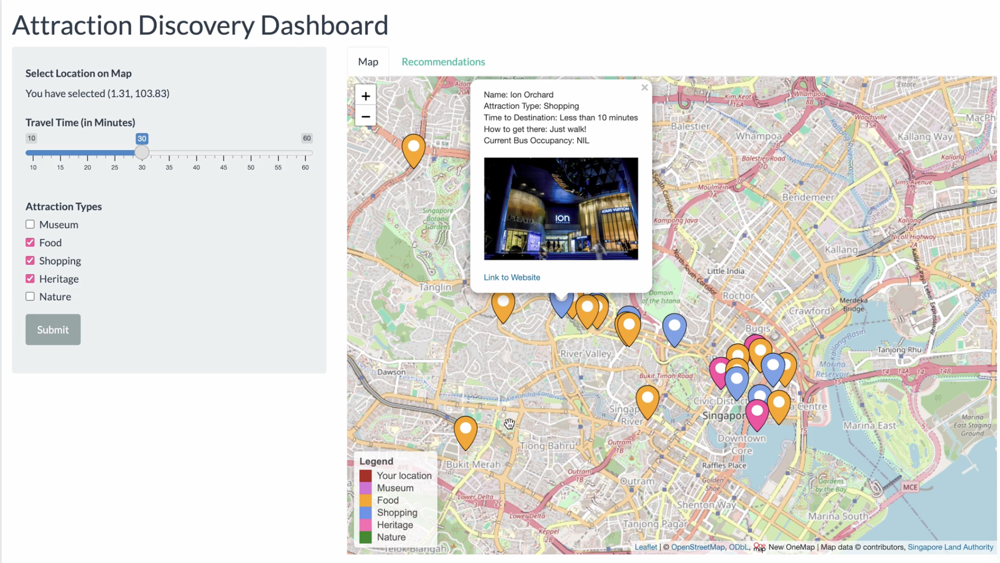

Hello! This is the GitHub repo for the **Attraction Discovery Dashboard**, the product of our efforts as part of our DSE3101 Project. 
We are Niyun, Jay, Shae-Anne and Tong, and over the past weeks we have been working on the topic of public transportation in Singapore using LTA bus data. 
The aim of our dashboard is to reduce the burden of travel planning for tourists visiting Singapore!

Have you ever tried planning an itinerary but found yourself going back and forth between websites for recommendations and google maps for travel times? Well this is the main pain point we are trying to address.

Luckily, with our dashboard, things just got a whole lot easier. 

The Attraction Discovery Dashboard is an all in one tool for tourists to find a place to visit in Singapore. Users can personalise the recommendations to their locations, travel times and attraction type preferences.
The results recommended by the dashboard also provides a comprehensive summary of which bus route to take, real-time bus occupancy levels and details on the attractions.  

If you would like to try out the dashboard for yourself, feel free to take a look at our technical documentation file for details on implementation. Thank you! 

